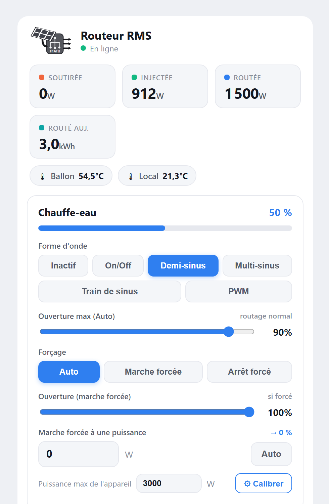
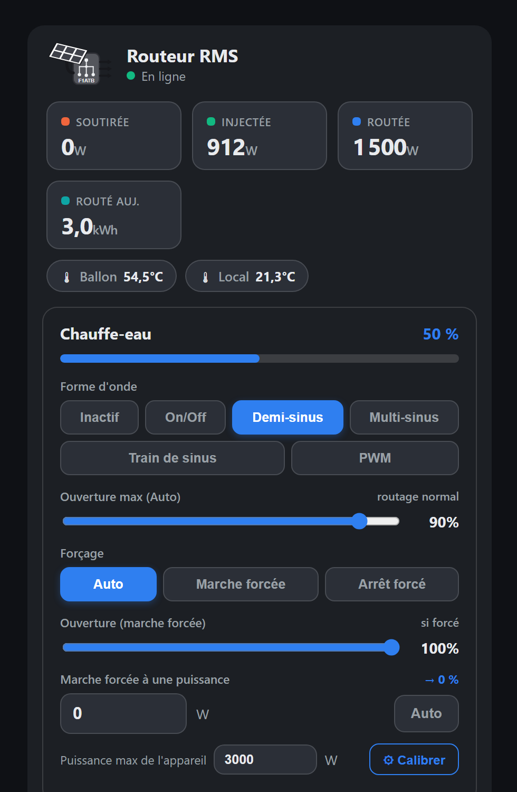
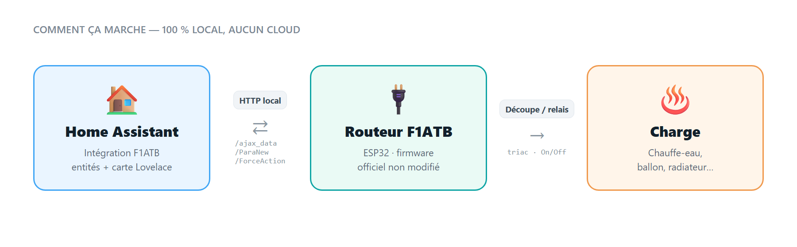

  

  
  
  
  

Intégration **Home Assistant** pour le [routeur solaire F1ATB](https://github.com/F1ATB/Solar-Router-F1ATB)
(RMS / ESP32). Elle fonctionne avec le **firmware officiel, sans aucune modification** : tout se passe
côté Home Assistant, en dialoguant avec le routeur via son **API HTTP locale** (`local_polling`, 100 % local,
aucun cloud).

L'intégration **lit** les mesures (puissances, énergies, ouverture du routage, système) **et pilote** le
routage (forme d'onde, ouverture max, marche/arrêt forcés) — le tout accompagné d'une **carte Lovelace
interactive** qui suit le thème de votre interface.

<table align="center">
  <tr>
    <td align="center"><b>Thème clair</b></td>
    <td align="center"><b>Thème sombre</b></td>
  </tr>
  <tr>
    <td></td>
    <td></td>
  </tr>
</table>

---

## ✨ Points forts

- **100 % firmware officiel** — rien à flasher, rien à modifier sur le routeur.
- **Entités dynamiques** — elles n'apparaissent **que pour les actions actives** ; une action passée
  en « Inactif » (depuis HA *ou* l'interface web du routeur) voit ses entités disparaître automatiquement.
- **Pilotage complet** de chaque action : forme d'onde, ouverture max, forçage marche/arrêt.
- **Marche forcée à une puissance donnée (W)** — entrez la puissance à router, l'ouverture est calculée
  automatiquement ; **calibration auto** de la puissance max de l'appareil en un clic (voir plus bas).
- **Énergie fiable** — le « routé aujourd'hui » est recalculé depuis le **compteur cumulé à vie**, donc
  **insensible aux redémarrages** du routeur (voir plus bas).
- **Sondes de température** — les canaux configurés (jusqu'à 4 : DS18B20, externe ou MQTT) sont détectés
  et exposés automatiquement, avec leur nom.
- **Capteur de disponibilité** (`Connecté`) pour suivre quand le routeur est en marche.
- **Carte Lovelace stylée**, chargée automatiquement, **thème clair/sombre** automatique.
- **Local & rapide** — polling toutes les 5 s (configurable), aucune dépendance externe.

---

## 📋 Entités

### Par action active

| Entité | Type | Réglage | Écriture |
|---|---|---|---|
| **Forme d'onde** | `select` | Inactif / Découpe (triac) ou On-Off (relais) / Demi-sinus / Multi-sinus / Train de sinus / PWM | `/ParaNew` — **persistant** |
| **Ouverture max (Auto)** | `number` (0–100 %) | *(triac)* **plafond d'ouverture du routage automatique** (`Vmax`, toutes périodes) | `/ParaNew` — **persistant** |
| **Ouverture (marche forcée)** | `number` (0–100 %) | ouverture appliquée **quand le routage est forcé en marche** (`ForceOuvre`) | `/ParaNew` — **persistant** |
| **Forçage** | `select` | Auto / Marche forcée / Arrêt forcé | `/ForceAction` |
| **Marche forcée (W)** | `number` (W) | puissance à router de force → ouverture calculée + marche forcée ; **0 = Auto** | `/ParaNew` + `/ForceAction` |
| **Puissance max** | `number` (W) | calibration : puissance à 100 % d'ouverture (côté HA, saisie manuelle possible) | — (stocké dans HA) |
| **Calibrer puissance max** | `button` | lance la mesure automatique de la puissance max | `/ForceAction` |
| **Ouverture** | `sensor` (%) | ouverture instantanée du routage | lecture |

> L'index 0 correspond à la sortie **triac** (découpe de sinus) ; les index suivants aux **relais** (On/Off).

### Capteurs globaux (toujours présents)

| Entité | Unité | Détail |
|---|---|---|
| **Soutirée réseau** | W | puissance tirée du réseau |
| **Injectée réseau** | W | puissance injectée vers le réseau |
| **Puissance routée** | W | puissance envoyée vers la charge |
| **Énergie routée aujourd'hui** | kWh | journalier **robuste** (cumulé − minuit), remis à zéro à minuit |
| **Énergie routée totale** | kWh | compteur **à vie** — idéal pour le tableau de bord Énergie |
| **Température** (× canaux configurés) | °C | une entité par canal (0–3) configuré sur le routeur (DS18B20 / externe / MQTT), avec son nom |
| **Connecté** | on/off | connectivité du routeur (reste dispo même hors ligne) |

---

## 🚀 Installation (HACS)

1. HACS → menu **⋮** → **Dépôts personnalisés**
2. URL : `https://github.com/WillSpecIm/Integration-f1atb` — Catégorie : **Integration**
3. **Télécharger** l'intégration, puis **redémarrer** Home Assistant
4. **Paramètres → Appareils & services → Ajouter une intégration → F1ATB Solar Router**
5. Saisir l'**adresse IP** du routeur (ex. `192.168.1.101`)

Installation manuelle (sans HACS)

Copiez le dossier `custom_components/f1atb/` dans le `config/custom_components/` de votre Home Assistant,
redémarrez, puis ajoutez l'intégration comme ci-dessus.

---

## ⚙️ Options

Accessibles via **Configurer** sur l'intégration :

- **Intervalle d'interrogation** (défaut **5 s**) — plus court = détection plus rapide, plus de trafic.
- **Durée d'un forçage** en minutes (défaut **720** = 12 h) — durée appliquée lorsqu'on choisit
  « Marche forcée » / « Arrêt forcé » ; le firmware décompte puis repasse en Auto.

---

## 🎛️ Carte Lovelace

La carte `custom:f1atb-card` est **chargée automatiquement** par l'intégration (rien à installer) et
**auto-détecte** le routeur. Elle affiche les tuiles de puissance, un indicateur **En ligne / Hors ligne**,
et par action active : la forme d'onde (boutons), l'ouverture max (curseur) et le forçage. Elle **suit le
thème** de Home Assistant (clair/sombre).

**Ajout :** tableau de bord → **Ajouter une carte** → chercher **« F1ATB Solar Router »** (avec aperçu).

Si la carte n'apparaît pas dans le sélecteur

1. Videz le cache du navigateur (**Ctrl+F5**) après le redémarrage de HA.
2. Sinon, ajoutez-la en **ressource** : Paramètres → Tableaux de bord → Ressources → Ajouter →
   URL `/f1atb/f1atb-card.js`, type **Module JavaScript** → Ctrl+F5.

Vous pouvez aussi construire une carte avec les **cartes natives** de HA (les `select` s'affichent en menu
déroulant, les `number` en curseur) — aucune carte custom nécessaire.

---

## 🔋 Suivi d'énergie fiable

Le compteur journalier interne du firmware peut se remettre à zéro lors d'un **redémarrage du routeur**.
Cette intégration contourne le problème :

- **Énergie routée aujourd'hui** = *compteur cumulé actuel − compteur cumulé à minuit*. La référence de
  minuit est **mémorisée côté Home Assistant** (elle survit à un redémarrage du routeur **et** de HA).
- Pour l'onglet **Énergie** de Home Assistant, utilisez plutôt **Énergie routée totale** (compteur à vie) :
  HA calcule lui-même les totaux jour/mois, de façon totalement robuste.

---

## ⚡ Marche forcée à une puissance donnée

Plutôt que de raisonner en pourcentage d'ouverture, vous indiquez directement **la puissance à router** :

1. **Calibrez une fois** la puissance max de l'appareil (puissance consommée à 100 % d'ouverture) :
   - **Automatique** : bouton **« Calibrer »** → l'intégration ouvre à 100 %, laisse la mesure se stabiliser,
     **moyenne la puissance routée sur ~10 s** et enregistre le résultat (procédure ~15 s, retour en Auto ensuite).
   - **Manuel** : saisissez la valeur à la main dans **« Puissance max de l'appareil »** (les deux méthodes
     restent utilisables à tout moment).
2. **Entrez la puissance à router** dans **« Marche forcée (W) »** (ex. `1500`). L'intégration calcule
   l'ouverture (`puissance / puissance_max × 100`, ex. **50 %**), l'écrit et **force la marche**.
3. **Revenez en Auto** en remettant `0` (ou via le bouton **Auto** de la carte / le sélecteur *Forçage*).

> 💡 Calibrez quand l'appareil peut réellement consommer (ex. chauffe-eau froid) pour mesurer sa vraie
> puissance. La relation puissance/ouverture est supposée linéaire (approximation suffisante en pratique).

---

## 🔎 Comment ça marche

  

| Usage | Endpoint(s) |
|---|---|
| Mesures live (puissances, énergies, températures) | `/ajax_data` |
| État des actions **actives** (pilote les entités dynamiques) | `/ajax_etatActions` |
| Système (uptime, RSSI, mémoire, IP) | `/ajax_dataESP32` |
| Configuration (mode `Actif`, `ForceOuvre`) | `/ParaFixe` |
| Écriture d'un réglage persistant | lecture `/ParaFixe` → modif du champ → renvoi `/ParaNew` |
| Forçage marche/arrêt | `/ForceAction?NumAction=…&Force=…` |

Aucune clé d'accès n'est requise (les endpoints ajax et `/ForceAction` ne la vérifient pas). Une écriture
persistante reproduit exactement le bouton « Sauvegarder » de l'interface web du routeur.

> **Note technique :** `/ParaNew` doit être envoyé en `Content-Type: text/plain` — sinon l'ESP32 parse le
> corps comme un formulaire et **ignore silencieusement** le JSON (réponse OK mais sans effet).

---

## 🩺 Dépannage

- **« icône non disponible » sur l'intégration** — normal pour une intégration custom (nécessiterait une PR
  sur `home-assistant/brands`). Sans effet sur le fonctionnement.
- **Routeur hors ligne** — la carte ne plante pas : elle affiche « Hors ligne », et le capteur `Connecté`
  passe à *off*. Le retour en ligne est automatique.
- **Une action n'a pas d'entités** — c'est voulu : seules les actions **actives** en ont. Activez la forme
  d'onde (≠ Inactif) sur le routeur ou depuis HA.

---

## 📦 Versions

Voir les [Releases](https://github.com/WillSpecIm/Integration-f1atb/releases). Mise à jour via HACS
(⋮ → *Re-télécharger* / *Update*).

## 📄 Licence

[MIT](LICENSE).

---

*Ce projet n'est pas affilié à F1ATB ; il s'appuie sur l'API publique du firmware officiel. Merci à
[F1ATB](https://github.com/F1ATB/Solar-Router-F1ATB) pour ce super routeur solaire open-source.*
